# Enterprise Agentic RAG Platform


A production-style Agentic Retrieval-Augmented Generation (RAG) platform featuring hybrid retrieval, graph-based multi-agent orchestration, conversational memory, tool-calling agents, observability pipelines, and web-augmented reasoning workflows.

---

## Live Demo

Frontend Demo:
https://enterprise-agentic-rag-platform.streamlit.app/

Backend API (Swagger):
https://enterprise-agentic-rag-platform-production.up.railway.app/docs

Deployed on Railway with PostgreSQL and Qdrant Cloud.

---

# Overview

This project implements an enterprise-oriented AI assistant architecture capable of:

* semantic document retrieval,
* conversational question answering,
* hybrid search,
* multi-tool orchestration,
* conversational memory,
* evaluation and observability,
* live web search augmentation.

The system combines FastAPI, LangGraph, PostgreSQL, Qdrant, OpenAI APIs, and multi-agent workflows to simulate production-style AI engineering systems.

---

# Architecture Diagrams

## System Architecture
```
User
  ↓
FastAPI Backend
  ↓
LangGraph Orchestrator
  ↓
Planner Agent
  ↓
Router Agent
 ├── Retrieval Tool
 │     ↓
 │   Hybrid Retrieval
 │   ├── Qdrant Vector Search
 │   ├── BM25 Retrieval
 │   └── CrossEncoder Reranking
 │
 ├── Calculator Tool
 │
 └── Web Search Tool (Tavily)
  ↓
LLM Response Generation
  ↓
Conversation Memory
  ↓
Evaluation + Observability
```

The platform combines FastAPI, LangGraph, PostgreSQL, Qdrant, OpenAI APIs, conversational memory, hybrid retrieval, and tool-calling agents into a production-style AI assistant architecture.

---

## Retrieval Pipeline

```
User Query
   ↓
Embedding Generation
   ↓
Semantic Search (Qdrant)
   +
BM25 Retrieval
   ↓
Merge Results
   ↓
CrossEncoder Reranking
   ↓
Top Context Chunks
   ↓
LLM Response
```

The retrieval workflow combines semantic vector search, BM25 keyword retrieval, and CrossEncoder reranking to improve retrieval precision and grounding quality.

---

## Agent Workflow

```
Planner Agent
   ↓
Router Agent
   ↓
Tool Agent
   ↓
Verification Agent
   ↓
Response Agent
```

LangGraph orchestrates multiple specialized agents including planning, routing, retrieval, verification, tool execution, and response generation.

---

# Features

## Retrieval-Augmented Generation (RAG)

* Dense vector retrieval using OpenAI embeddings
* Qdrant vector database integration
* PostgreSQL metadata persistence
* PDF ingestion and chunking pipelines

---

## Hybrid Retrieval Pipeline

* Semantic vector search
* BM25 keyword retrieval
* CrossEncoder reranking
* Metadata-aware retrieval workflows

---

## Agentic AI Workflows

Implemented using LangGraph orchestration:

* Planner Agent
* Router Agent
* Retrieval Agent
* Verification Agent
* Response Generation Agent
* Tool Execution Agent

---

## Conversational Memory

* Session-based memory persistence
* Multi-turn conversational context
* Context-aware retrieval workflows

---

## Tool Calling

Dynamic tool-routing architecture supporting:

* Calculator Tool
* Retrieval Tool
* Web Search Tool (Tavily)

---

## Observability and Evaluation

* Token usage tracking
* Latency monitoring
* Grounding evaluation
* Retrieval evaluation
* LangSmith tracing integration

---

# Tech Stack

## Backend

* FastAPI
* Python
* SQLAlchemy
* Docker

## Databases

* PostgreSQL
* Qdrant Vector Database

## AI/LLM Stack

* OpenAI API
* LangChain
* LangGraph
* SentenceTransformers
* BM25 Retrieval
* CrossEncoder Reranking

## Observability

* LangSmith
* RAG Evaluation Pipelines

---

# API Endpoints

## Upload PDF

```http
POST /api/v1/ingest/upload-pdf
```

Uploads and indexes PDF documents.

---

## Chat Endpoint

```http
POST /api/v1/rag/chat
```

Supports:

* conversational retrieval,
* memory-aware interactions,
* tool-calling workflows,
* web-augmented responses.

---

# API Demonstration

## Swagger Documentation

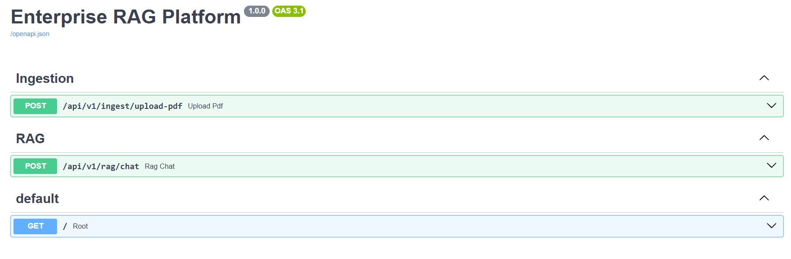

FastAPI automatically generates interactive API documentation for testing ingestion and conversational endpoints.

---

## PDF Ingestion Pipeline

### Upload Request

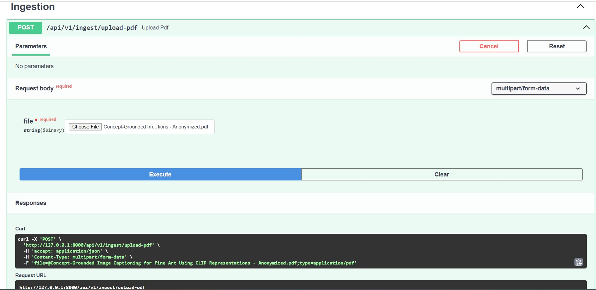

### Upload Response

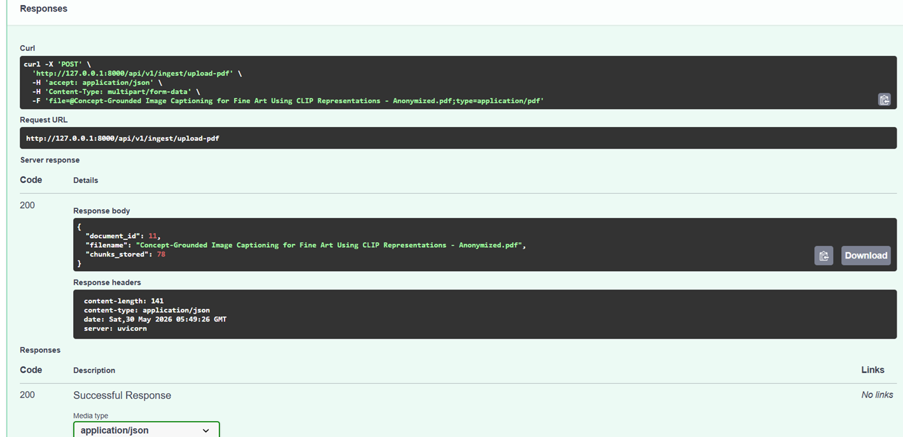

PDF documents are parsed, chunked, embedded, indexed in Qdrant, and stored with metadata in PostgreSQL.

---

## Retrieval-Augmented Generation

### RAG Request

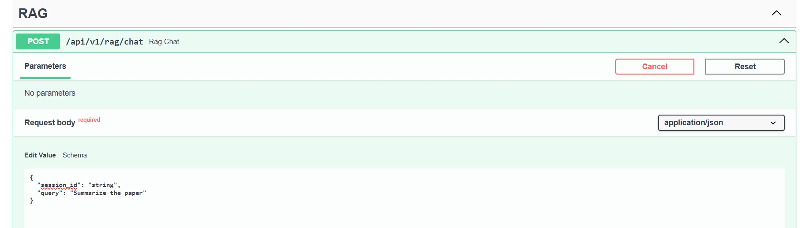

### RAG Response

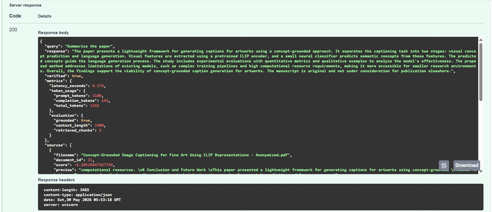

Retrieved document chunks are passed through the hybrid retrieval and reranking pipeline before grounded response generation.

---

## Agent Execution Trace

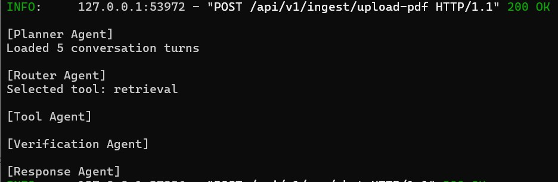

The LangGraph workflow executes multiple agents sequentially:

- Planner Agent
- Router Agent
- Tool Agent
- Verification Agent
- Response Agent

This enables modular orchestration and dynamic workflow execution.

---

## Tool Calling – Calculator

### Calculator Request

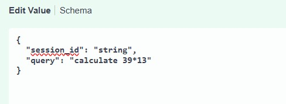

### Calculator Response

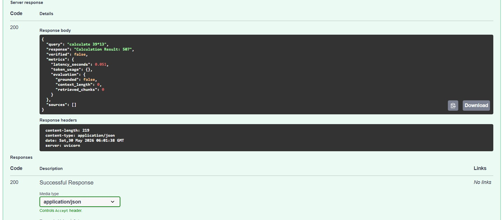

The Router Agent dynamically identifies mathematical queries and invokes the Calculator Tool without performing document retrieval.

---

## Tool Calling – Web Search

### Web Search Request

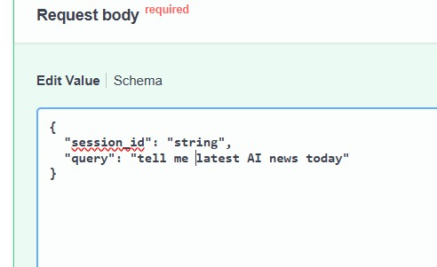

### Web Search Response

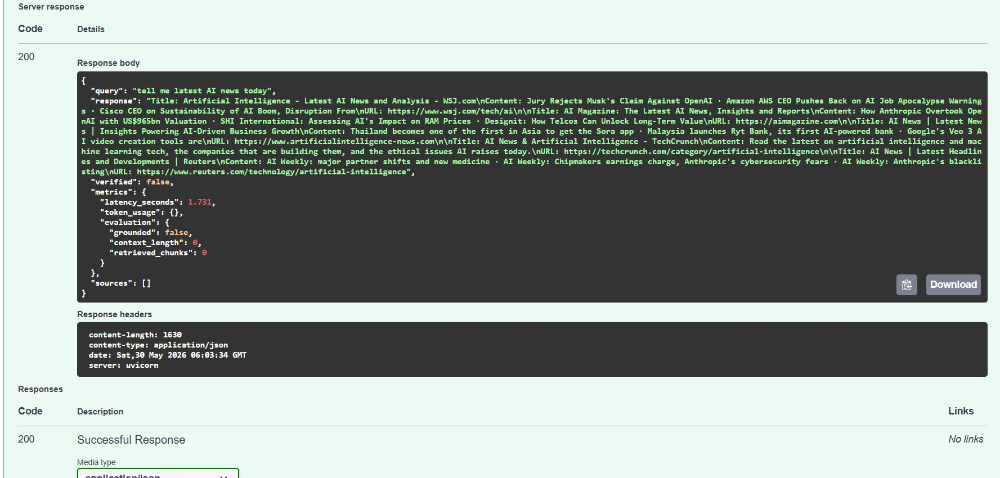

The Web Search Tool uses Tavily to retrieve current information from external sources when user queries require live knowledge beyond uploaded documents.

---

# Streamlit Frontend

A lightweight frontend was developed using Streamlit to provide an interactive interface for document ingestion and conversational retrieval workflows.

## PDF Upload

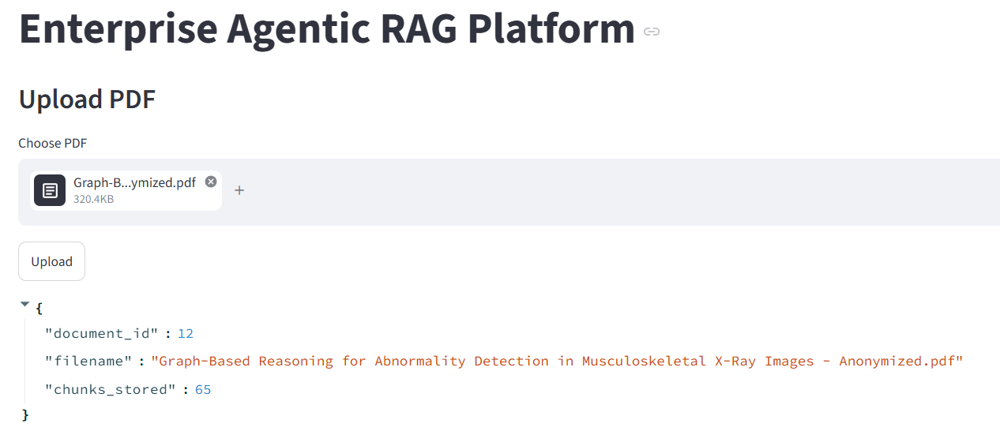

---

## Chat Interface

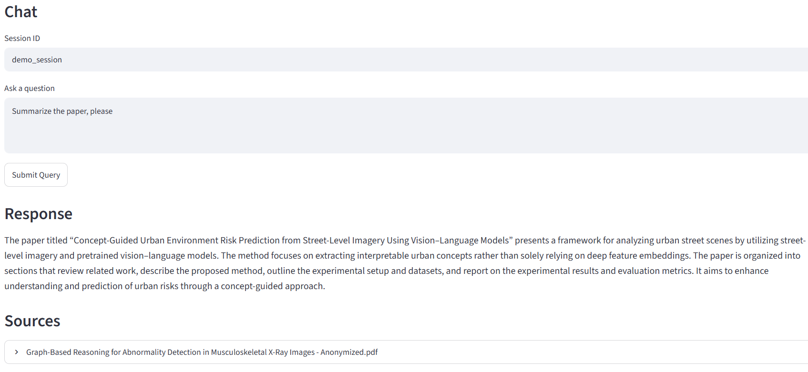

---

## Conversational Memory

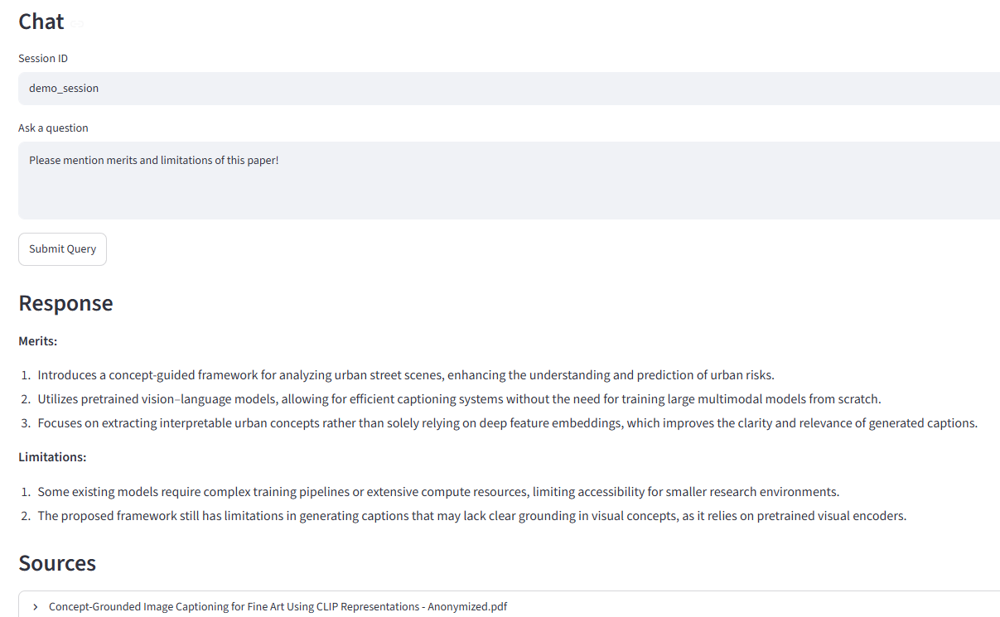

---

## Calculator Tool

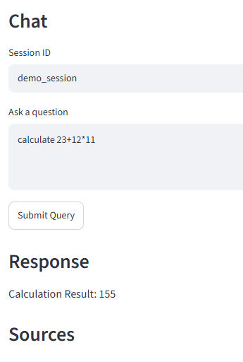

---

## Web Search Tool

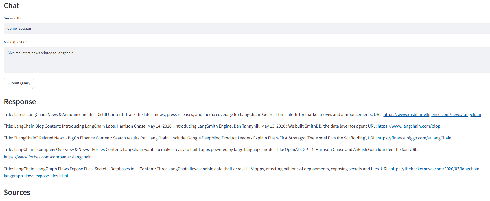

---

# Local Setup

## Clone Repository

```bash
git clone https://github.com/digit987/enterprise-agentic-rag-platform.git
cd enterprise-agentic-rag-platform
```

---

## Create Virtual Environment

```bash
python -m venv venv
source venv/bin/activate
```

---

## Install Dependencies

```bash
pip install -r requirements.txt
```

---

## Configure Environment Variables

Create `.env` file:

```env
OPENAI_API_KEY=your_key
LANGCHAIN_API_KEY=your_key
TAVILY_API_KEY=your_key
```

---

## Start Infrastructure

```bash
docker compose up -d
```

---

## Start Backend

```bash
uvicorn app.main:app --reload
```

---

# Future Improvements

* Streaming responses
* Redis caching
* Kubernetes deployment
* Authentication and RBAC
* Async task queues
* Multi-modal retrieval
* Autonomous planning agents
* Advanced evaluation metrics

---

# Repository Structure

```text
enterprise-agentic-rag-platform/

├── app/
│   ├── api/
│   ├── rag/
│   ├── services/
│   ├── tools/
│   ├── db/
│   ├── models/
│   └── core/
│
├── tests/
├── uploads/
├── docker-compose.yml
├── requirements.txt
├── .gitignore
└── README.md
```

---

# License

MIT License
